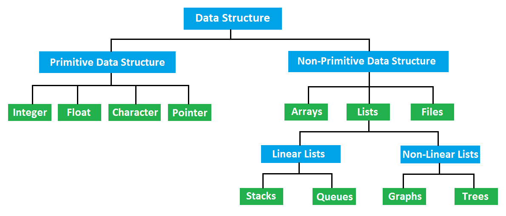
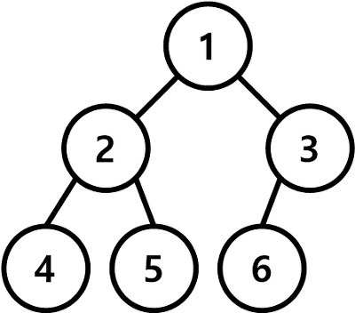
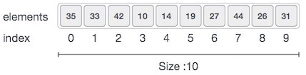
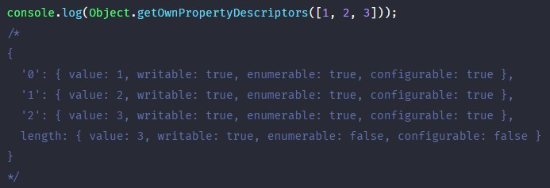
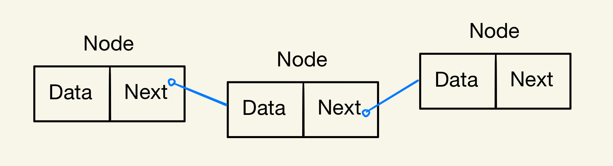
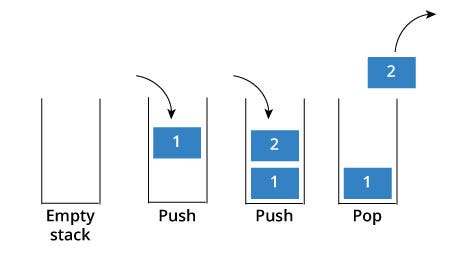
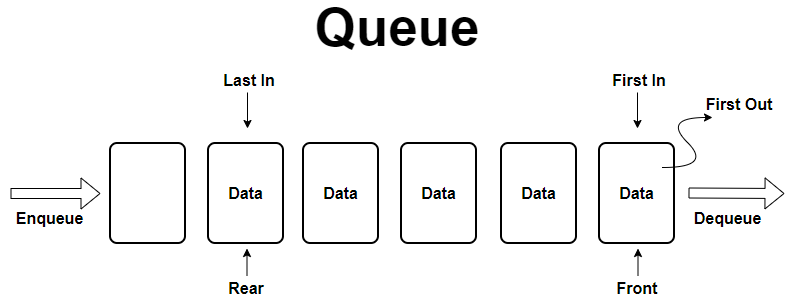
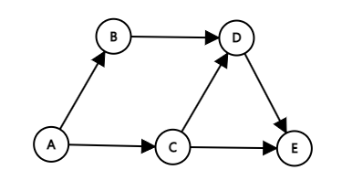
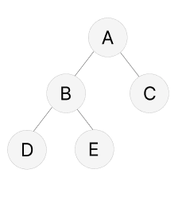

# 1주차 스터디 - 기초 개념 이해

## 자료구조 (Data Structure)



- 단순 구조 (Primitive Data structure)

  - 정수 (Integer)
  - 실수 (Float)
  - 문자 (Character)
  - 포인터 (Pointer)

- 복합 구조 (NonPrimitive Data Structure)

  - 파일 구조(Files)

    - 순차 파일
    - 색인 파일
    - 직접 파일

  - 선형 구조 (Linear Lists)

    - [배열 (Array)](#array)
    - [리스트 (Lists)](#list)
    - [스택 (Stack)](#stack)
    - [큐 (Queue)](#queue)
    - [덱 (Deque)](#deque)

  - 비선형 구조 (Non-Linear Lists)
    - [그래프 (Graph)](#graph)
    - [트리 (Tree)](#tree)

---

## 선형 구조란


> 데이터가 순차적으로 배열되어 있음.

> 단일 레벨로 표현되어 단일 실행으로 모든 요소를 순회 가능.

> 메모리가 선형으로 배열되어 구현이 쉬움.

> 저장되는 요소의 전후관계가 1:1

## 비선형 구조란



> 데이터가 계층적으로 연결되어 있음.

> 계층적이라 단일 실행으로 모든 요소를 순회할 수 없어 여러번 실행해야 함.

> 선형데이터에 비해 구현 어려움.

> 저장되는 요소의 전후관계가 1:n 또는 n:m 이다.

---

## 선형 구조

<a id="array"></a>

- 배열 (Array)
  - 
  - 기록 밀도가 1이기 때문에 공간 낭비가 적고 사용이 쉬움.
  - 일반 적인 배열은 하나의 타입으로 통일 되어 있으며 연속적으로 인접해 있는 **밀집 배열**이다.
  - 밀집 배열의 요소는 동일한 크기를 가지며 연속적으로 이어져 있어 정렬되어 있는 배열의 경우 시간복잡도가 O(1)으로 매우 효율적이며 고속으로 동작한다는 장점이 있다.
  - 하지만 정렬되지 않은 배열의 경우 특정 값을 찾기 위해 처음부터 찾을때까지 선형 탐색을 해야 되며 시간 복잡도는 O(n)이다.
  - 자바스크립트의 배열은 일반적인 배열이 아니고 배열을 흉내낸 객체로 볼 수 있다. 이미지를 보면 배열은 인덱스를 키로 프로퍼티를 갖으며 배열의 요소는 사실 프로퍼티의 값이다.
  - 
  - 자바스크립트의 배열은 객체이기 요소가 연속적으로 이어져 있지 않는 **희소 배열**이다. 이때문에, 인덱스로 접근할 경우 **밀접 배열**보다 성능적으로 느리다는 단점이 있지만, 특정 요소를 탐색하거나 삽입 또는 삭제할 경우 더 빠른 성능을 기대할 수 있다.
  - JS로 배열 선언 &nbsp;&nbsp; `const array = [10, 20, 30, 40, 50]`
  - 인덱스로 접근 &nbsp;&nbsp; `array[1] => 20, array[4] => 50`
  - 배열 목록, 힙, 해시 테이블, 벡터 및 행렬과 같은 데이터 구조 구축하기 위한 빌딩 블록으로 사용.
  - 삽입 정렬, 빠른 정렬, 버블 정렬 및 병합 정렬과 같은 정렬 알고리즘에 사용.

<a id="list"></a>

- 리스트 (List)

  - 배열 리스트 (Array List)

    - **배열과 배열 리스트의 차이점**
    - 배열은 크기가 고정되어 있으며 한 번에 모든 요소를 메모리에 할당함
    - 배열은 특정 인덱스에 데이터를 추가할 경우 원래 있던 데이터가 추가한 데이터로 바뀌는 개념이다. 삭제할 경우 해당 인덱스는 빈 공간이 된다.
    - 배열 리스트는 특정 인덱스에 데이터를 추가할 경우 해당 인덱스에 있던 데이터는 뒤로 밀려나고 새로운 데이터가 삽입된다. 반대로 삭제할 경우 해당 인덱스의 데이터를 삭제하고 뒤의 데이터들을 앞으로 한 칸씩 가져온다.
    - 예시 (JavaScript)

      ```javascript
      // 배열
      const array = [10, 20, 30, 40, 50, 60, 70, 80];

      // 3번째 인덱스 데이터 추가 | 변경
      array[3] = 100; // array => [10, 20, 30, 100, 50, 60, 70, 80]

      // 3번째 인덱스 데이터 삭제
      delete array[3]; // array => [10, 20, 30, undefined, 50, 60, 70, 80]
      ```

      ```javascript
      // 배열 리스트
      const array = [10, 20, 30, 40, 50, 60, 70, 80];

      // 3번째 인덱스 데이터 추가
                                                        ∨추가됨
      array.splice(3, 0, 100); // array => [10, 20, 30, 100, 40, 50, 60, 70, 80]

      // 3번째 인덱스 데이터 삭제
                                                  원래 있던 100이 삭제된 후
                                                ∨뒤에 있는 데이터를 1칸씩 가져옴
      array.splice(3, 1) // array => [10, 20, 30, 40, 50, 60, 70, 80]
      ```

    - **장점과 단점**
    - 배열의 구조이기 때문에 인덱스를 이용해 접근이 빠르다
    - 처음이나 중간의 데이터를 추가나 삭제할 시 이후의 데이터들이 한칸씩 당겨지거나 물러나야 하기 때문에 속도가 느리다.

  - 연결 리스트 (Linked List)
  - 연결 리스트는 각 노드가 데이터와 다음 노드를 가리키는 포인터로 연결되어 있는 구조이다.
    
  - 예시 (JavaScript)

    ```javascript
    // 연결 리스트의 노드 정의
    class Node {
      constructor(data) {
        this.data = data; // 데이터
        this.next = null; // 다음 노드를 가리키는 포인터
      }
    }

    // 연결 리스트 정의
    class LinkedList {
      constructor() {
        this.head = null; // 헤드 포인터
        this.tail = null; // 꼬리 포인터
      }

      // 노드를 연결 리스트의 끝에 추가하는 메서드
      append(data) {
        const newNode = new Node(data);

        // 연결 리스트가 비어있는 경우
        if (this.head === null) {
          this.head = newNode;
          this.tail = newNode;
        } else {
          // 연결 리스트에 이미 요소가 있는 경우
          this.tail.next = newNode;
          this.tail = newNode;
        }
      }
    }

    // 연결 리스트 생성
    const linkedList = new LinkedList();

    // 노드 추가
    linkedList.append(10);
    linkedList.append(20);
    linkedList.append(30);
    linkedList.append(40);
    linkedList.append(50);

    // 결과 출력
    console.log(linkedList);
    /*
      LinkedList {
        head: Node { data: 10, next: Node { data: 20, next: [Node] } },
        tail: Node { data: 30, next: null }
      }
    */
    ```

  - 배열 리스트는 요소를 삭제할 경우 고정되어 있는 크기를 조정하기 위해 삭제한 요소 뒤의 모든 요소를 당기는 작업이 필요하다. 하지만, 연결 리스트는 크기가 동적이며 노드를 추가하거나 삭제하면 포인터만 갱신하기 때문에 삽입과 삭제가 효율적이다.
  - 탐색을 할 경우 배열 리스트는 인덱스를 통해 바로 접근이 가능해 시간 복잡도가 O(1)인 반면에 연결 리스트는 순차적으로 탐색을 해야 하기 때문에 시간 복잡도가 O(n)으로 비효율적이다.

<a id="stack"></a>

- 스택 (Stack)

  - 순서가 보존되는 선형 데이터 구조이다.
  - LIFO(Last In First Out) 가장 마지막의 요소부터 처리한다.
  - ex) 실행 취소, 재귀 프로그래밍에서 함수 호출, 프링글스 과자
  - 
  - 예시 (JavaScript)

    ```javascript
    const stack = []; // empty stack

    stack.push(10); // stack => [10]         들어온 요소 : 10
    stack.push(20); // stack => [10, 20]     들어온 요소 : 20
    stack.push(30); // stack => [10, 20, 30] 들어온 요소 : 30

    stack.pop(); // stack => [10, 20]     빠진 요소 : 30
    ```

<a id="queue"></a>

- 큐 (Queue)

  - 큐는 데이터의 삽입과 삭제가 다른 쪽에서 이루어지는 선형 자료구조이다.
  - FIFO(First-In-First-Out)으로 선입선출 => 먼저 들어온 것이 먼저 나가는 구조이다.
  - ex) 대기열
  - 
  - 예시 (JavaScript)

    ```javascript
    const queue = []; // empty queue

    queue.push(10); // queue => [10]         들어온 요소 : 10
    queue.push(20); // queue => [10, 20]     들어온 요소 : 20
    queue.push(30); // queue => [10, 20, 30] 들어온 요소 : 30

    queue.shift(); // queue => [20, 30]     빠진 요소 : 10
    ```

<a id="deque"></a>

- 덱 (Deque)

  - 덱은 "Double Ended Queue"의 약어로, 양쪽 긑에서 삽입과 삭제가 모두 가능한 선형 자료구조로 큐와 스택의 특징을 가지고 있다.

    

  - 앞과 뒤에서 삽입과 삭제가 모두 O(1)의 시간 복잡도를 가진다.
  - 덱의 주요한 연산은 다음과 같다
    ```
    InserFront : 덱의 맨 앞에 요소를 삽입. => unshift
    InserBack : 덱의 맨 뒤에 요소를 삽입. => push
    DeleteFront : 덱의 맨 앞의 요소를 삭제하고 반환. => shift
    DeleteBack : 덱의 맨 뒤의 요소를 삭제하고 반환. => pop
    GetFront : 덱의 맨 앞의 요소를 반환. 제거하지 않는다.
    GetBack : 덱의 맨 뒤의 요소를 반환. 제거하지 않는다.
    IsEmpty : 덱이 비어있는지 확인.
    Size : 덱의 저장된 요소의 개수를 반환.
    ```
---

## 비선형 구조

<a id="graph"></a>

- 그래프 (Graph)

  - 그래프는 객체들 간의 연결 관계를 표현하는 추상적인 자료구조이다.
  - 그래프는 정점(Vertex)와 간선(Edge)로 구성된다.
  - 정점은 개별적인 요소를 나타내며 간선은 정점들간의 관계를 나타낸다.
  - 그래프의 일반적인 형타로는 2가지가 있는데 **무방향 그래프**와 **방향 그래프** 이다.
  - 무방향 그래프는 간선이 양쪽으로 이동한다.
  - 방향 그래프는 간선에 방향성이 존재한다.
  - ex) 지도에서 도시(Vertex)와 도로(Edge), 친구 관계에서 사람(Vertex)과 관계성(Edge)
  - 예시 (JavaScript)

    ```javascript

    class Graph {
      constructor() {
        this.vertices = {}; // 정점들을 저장하기 위한 객체
      }
        

      // 정점 추가
      addVertex(vertex) {
        if (!this.vertices[vertex]) {
          this.vertices[vertex] = [];
        }
      }

      // 간선 추가 (방향 그래프)
      addEdge(fromVertex, toVertex) {
        if (this.vertices[fromVertex] && this.vertices[toVertex]) {
          this.vertices[fromVertex].push(toVertex);
        }
      }

      // 정점에 연결된 모든 이웃 정점 반환
      getNeighbors(vertex) {
        return this.vertices[vertex] || [];
      }

      // 그래프 출력
      print() {
        for (let vertex in this.vertices) {
          const neighbors = this.vertices[vertex];
          console.log(`${vertex} -> ${neighbors.join(', ')}`);
        }
      }
    }

    // 그래프 생성
    const graph = new Graph();

    // 정점 추가
    graph.addVertex('A');
    graph.addVertex('B');
    graph.addVertex('C');
    graph.addVertex('D');
    graph.addVertex('E');

    // 간선 추가
    graph.addEdge('A', 'B');
    graph.addEdge('A', 'C');
    graph.addEdge('B', 'D');
    graph.addEdge('C', 'D');
    graph.addEdge('C', 'E');
    graph.addEdge('D', 'E');

    // 그래프 출력
    graph.print();

    //  A -> B, C
    //  B -> D
    //  C -> D, E
    //  D -> E
    //  E -> 

    ```
    

<a id="tree"></a>

- 트리 (Tree)
  - 트리는 계층적인 구조를 가지는 비선형 자료구조이다.
  - 노드(Node)와 간선(Edge)으로 이루어져 있다.
  - 상위 노드를 부모 노드라고하고 하위 노드를 자식 노드라고 한다. 최상위 노드를 루트 노드라고 하며 각 노드는 0개 이상의 자식 노드를 가질 수 있다.
  - ex) DOM, 나무, 파일 시스템, 조직도
  - 예시 (JavaScript)
    ```javascript
    class TreeNode {
      constructor(value) {
        this.value = value;
        this.children = [];
      }

      // 자식 노드 추가
      addChild(childNode) {
        this.children.push(childNode);
      }
    }

    // 트리 생성
    const tree = new TreeNode('A');

    // 노드 추가
    const nodeB = new TreeNode('B');
    const nodeC = new TreeNode('C');
    const nodeD = new TreeNode('D');
    const nodeE = new TreeNode('E');

    tree.addChild(nodeB);
    tree.addChild(nodeC);
    nodeB.addChild(nodeD);
    nodeB.addChild(nodeE);
    ```
    

---

## 알고리즘 성능 평가 - 복잡도 (Complexity)

- 시간 복잡도
  - 알고리즘이 문제를 해결하는 데 걸리는 시간의 양을 측정합니다.
  - 주로 연산의 횟수를 기반으로 산정됩니다.
  - 일반적으로 최악의 경우 시간 복잡도를 분석합니다.
  - 보통 Big O 표기법을 사용하여 표현하며, 최악의 경우 연산 수행에 필요한 상한을 나타냅니다.
  - 시간 복잡도가 낮을수록 알고리즘의 효율성이 높습니다.
  
- 공간 복잡도
  - 알고리즘이 실행되는 동안 사용되는 메모리 공간의 양을 측정합니다.
  - 주로 추가적인 공간 사용(변수, 자료구조 등)을 고려하여 분석합니다.
  - 보통 Big O 표기법을 사용하여 표현하며, 알고리즘이 사용하는 공간의 상한을 나타냅니다.
  - 공간 복잡도가 낮을수록 알고리즘의 효율성이 높습니다.
---
