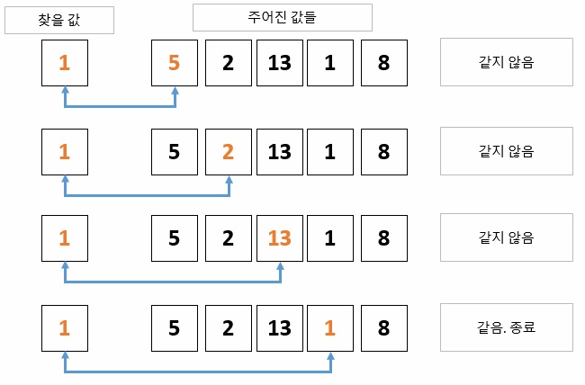

# 탐색 알고리즘 학습

## 탐색 종류

- 선형 탐색 (Linear Search)
- 이진 탐색 (Binary Search)
- 깊이 우선 탐색 (Depth-First Search, DFS)
- 너비 우선 탐색 (Breadth-First Search, BFS)
- 이동 탐색 (Jump Search)
- 보간 탐색 (Interpolation Search)
- 해시 탐색 (Hashing Search)
- 등...
---
## 탐색 특징

### 선형 탐색 (Linear Search)

> **리스트** 또는 **배열**에서 원하는 요소를 순차적으로 탐색하는 방법이다.

> 처음부터 끝까지 순서대로 요소를 비교하여 찾고자 하는 값을 찾을 때까지 반복한다.



```javascript
function linearSearch(arr, target) {
  for (let i = 0; i < arr.length; i++) {
    if (arr[i] === target) {
      return i; // 탐색 성공, 해당 요소의 인덱스 반환
    }
  }
  return -1; // 탐색 실패, -1 반환
}

// 예시 배열과 탐색 대상
const array = [4, 2, 9, 5, 1, 7, 6, 3, 8];
const target = 5;

const result = linearSearch(array, target);

if (result !== -1) {
  console.log(`탐색 성공! 인덱스 ${result}에서 발견되었습니다.`);
} else {
  console.log("탐색 실패! 대상을 찾을 수 없습니다.");
}
```

### 이진 탐색( = 이분 탐색) (Binary Search)

> **정렬된 리스트** 또는 **배열**에서 원하는 요소를 찾기 위해 중간 요소를 비교하고 탐색 범위를 반씩 줄여가는 방법이다.

> 이진 탐색은 탐색 범위를 빠르게 축소하여 빠른 검색을 가능하게 한다.


### 깊이 우선 탐색 (Depth-First Search, DFS)

> **그래프**나 **트리**에서 깊이 방향으로 탐색을 수행하는 알고리즘이다.

> 한 경로를 따라 끝까지 탐색한 후 다른 경로를 탐색한다.


### 너비 우선 탐색 (Breadth-First Search, BFS)

> 그래프나 트리에서 레벨 순서로 탐색을 수행하는 알고리즘이다.

> 한 레벨씩 넓게 탐색하며 같은 레벨의 노드를 모두 탐색한 후 다음 레벨로 넘어간다.


### 이동 탐색 (Jump Search)

> **정렬된 리스트** 또는 **배열**에서 요소를 찾기 위해 일정한 간격으로 이동하면서 비교하는 방법이다.

> 이동 탐색은 선형 탐색보다 효율적인 탐색을 제공한다.


### 해시 탐색 (Hashing Search)

> 해시 함수를 사용하여 값을 해시 테이블에 매핑한 후, 해시 충돌을 처리하면서 값을 찾는 방법이다.

> 해시 탐색은 상수 시간에 가까운 빠른 검색을 제공한다.


---
