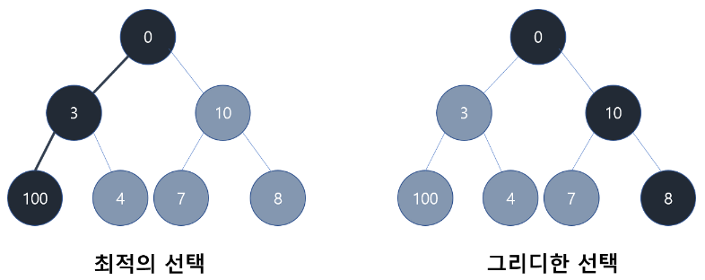
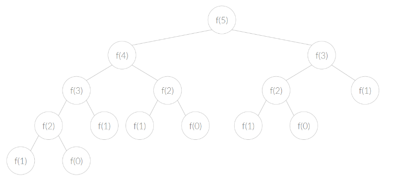
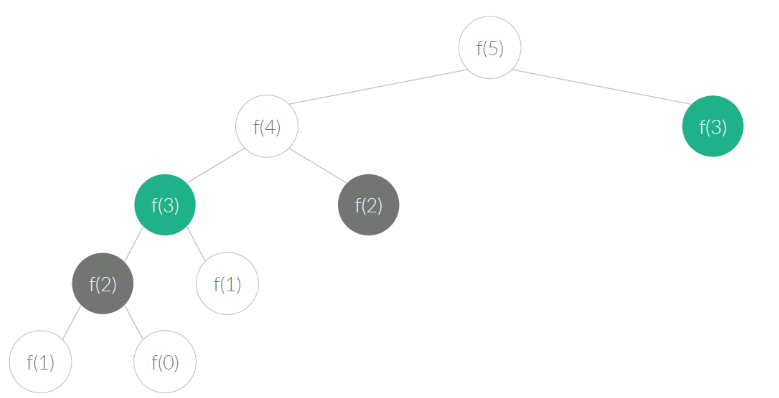

# 탐욕법(Greedy) & 동적 계획법(Dynamic Programming - DP) 학습

## 탐욕법(Greedy)

- 최적해를 구하는 문제를 해결하기 위한 알고리즘 설계 기법 중 하나

### 특징

> 각 단계에서 최선의 선택을 하는 방식으로 문제를 해결하는 접근법이다.

> 각 선택이 현재 단계에서는 최적이어도 전체적으로는 최적해를 보장하지 않는다.

> 선택한 옵션을 해결에 반영 후, 다음 단계로 넘어간다.

> 모든 단계가 완료될 때까지 반복한다.

### 장점

- 간단하고 직관적이다.
- 실행 속도가 빠르다.
- 실용적인 문제에서 유용하게 사용된다.

### 단점

- 최적해를 보장하지 않는다.

### 예시

- 가장 큰값을 구하라.
  
- 위의 그림에서 가장 큰 값을 구하면 100이다.
- 하지만 탐욕법을 적용하면 각 단계에서 가장 큰 값을 찾아가므로 첫 번째에서는 10을, 두번째에서 8을 선택한다.

### 거스름돈 문제

- 가장 적은 개수의 동전을 사용하여 지불해야 하는 금액을 거슬러 주자.
- 동전 종류 `[500, 100, 50, 10]`
- 거스름 돈 `1260`
- 정답 `[500, 500, 100, 100, 50, 10]`
- 코드

```javascript
function greedyCoinChange(coins, target) {
  coins.sort((a, b) => b - a); // 동전을 큰 순서대로 정렬
  const change = []; // 거스름돈 동전들을 담을 배열

  for (let coin of coins) {
    while (coin <= target) {
      // 현재 동전으로 거스름돈을 계속 만들 수 있을 때까지 반복
      change.push(coin); // 동전을 거스름돈 배열에 추가
      target -= coin; // 거스름돈에서 현재 동전의 가치만큼 빼기
    }
  }

  return change;
}

// 거스름돈 동전의 종류와 지불해야 할 금액
const coins = [500, 100, 50, 10];
const target = 1260;

const result = greedyCoinChange(coins, target);
console.log(result); // [500, 500, 100, 100, 50, 10]
```

---

## 동적 계획법(Dynamic Programming - DP)

- 큰 문제를 작은 하위 문제로 나누어 해결하는 알고리즘 설계 기법

### 특징

> 최적 부분 구조: 큰 문제의 최적 해결 방법은 작은 문제의 최적 해결 방법으로부터 구성된다.

> 중복 부분 문제: 작은 문제를 해결하는 과정에서 중복되는 부분문제가 발생한다.

### 접근 방식

> Top-down: 큰 문제를 작은 하위 문제로 분할하면서 푼다. 재귀 구현

> > 작은 하위 문제의 해결 방법을 찾는다. 이때, 이미 계산된 중복 부분 문제의 해답을 활용한다.

> > 작은 하위 문제들을 결합하여 큰 문제의 해답을 도출한다.

> Bottom-up: 작은 문제부터 차례대로 푼다. 반복문 이용

> > 문제의 크기를 조금씩 크게 만들면서 푼다.

> > 작은 문제를 풀어왔기 때문에, 큰 문제는 항상 풀 수 있다.

> > 반복하면 가장 큰 문제를 풀 수 있다.

### 장점

- 반복적인 계산과 중복되는 계산을 피함으로써 효율적인 해결 방법 제공
- 최적 부분 구조를 활용할 수 있다. 큰 문제를 작은 하위 문제로 분할하고 작은 문제의 최적 해결 방법을 활용하여 큰 문제의 최적 해결 방법을 구할 수 있다.

### 단점

- 추가적인 메모리 공간이 필요할 수 있다. 중복 계산을 피하기 위해 계산된 결과를 저장해야 하기 때문이다.
- 모든 문제에 적용할 수 없다.
- 최적 부분 구조와 중복 부분 문제의 조건을 충족하는 문제에만 효율적이다.

### 피보나치 수열

- 피보나치 수열의 정의는 다음과 같다.

  `F(0) = 0, F(1) = 1, F(n) = F(n-1) + F(n-2)`

- ex) [0, 1, 1, 2, 3, 5, 8, 13, 21 ...]

- 재귀적인 방법
  - 해당 방법은 매 수열을 구해야 하기 때문에 이진트리와 탐색속도가 같다.

```javascript
function fibonacciRecursive(n) {
  if (n <= 1) { // 1보다 작을 경우 n을 반환 ex) 0일 경우 0, 1일 경우 1
    return n;
  }
  return fibonacciRecursive(n - 1) + fibonacciRecursive(n - 2); //F(n) = F(n-1) + F(n-2)
}

// 테스트
console.log(fibonacciRecursive(5)); // 5
console.log(fibonacciRecursive(8)); // 21
```



- **반복적인 방법**
  - 해당 방법은 F(n-1)과 F(n-2)를 저장함으로서 모든 문제를 한 번씩만 푼다.
```javascript
function fibonacciIterative(n) {
  if (n <= 1) { // 1보다 작을 경우 n을 반환 ex) 0일 경우 0, 1일 경우 1
    return n;
  }

  let prev = 0; // F(n-2)
  let curr = 1; // F(n-1)

  for (let i = 2; i <= n; i++) {
    const temp = curr;
    curr = prev + curr;
    prev = temp;
  }

  return curr;
}

// 테스트
console.log(fibonacciIterative(5)); // 5
console.log(fibonacciIterative(8)); // 21
```


