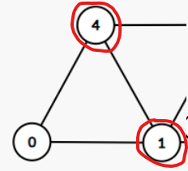

# 그래프 알고리즘 학습

## 그래프란?

> 그래프는 <strong>정점(Vertex)</strong>과 **간선**으로 이루어진 자료구조

> <strong>정점(Vertex)</strong>간의 관계를 표현하는 조직도

> 그래프는 루트 노드, 부모와 자식이라는 개념이 존재하지 않음

> <strong>무방향 그래프(Undirected graph)</strong>와 <strong>방향 그래프(Directed graph)</strong>가 있음

- 무방향 그래프

  

- 방향 그래프

  

- 이 외에도 가중치 그래프, 완전 그래프 등이 있다.

---

## 용어

- `정점(Vertex)` : 노드(node)라고도 하며 데이터가 저장되는 곳

  

- `간선(Edge)` : 링크(arcs)라고도 하며 노드간의 관계를 나타낸다

  

- `인접 정점(adjacent vertex)` : 간선에 의해 연결된 정점 (정점0의 인접 정점은 4와 1)

  

- `단순 경로(simple-path)` : 경로 중 반복되는 정점이 없고 같은 간선을 지나지 않는 경로

  

- `차수(degree)` : 무방향 그래프에서 하나의 정점에 인접 정점의 수 (정점 1의 차수는 4)

  

- `진출 차수(out-degree)` : 방향 그래프에서 사용되는 용어로 하나의 정점에서 외부로 향하는 간선의 수

  (아래 예시 방향 그래프에서 정점 4의 진출 차수는 3)

  

- `진입 차수(in-degree)` : 진출 차수와 반대의 개념으로 외부에서 하나의 정점으로 들어오는 간선의 수

  (아래 예시 방향 그래프에서 정점 1의 진입 차수는 2)

  

---

## 구현 방법

### 인접 행렬(Adjacency Materix)

- 인접 행렬은 그래프의 노드를 2차원 배열로 만든 것

  인접 정점이라면 1 아니면 0을 넣어서 만든다

  ```
                           0  1  2  3  4
                       0  [0, 1, 0, 0, 1]
    4 - 3              1  [1, 0, 1, 1, 1]
   / \ /         =>    2  [0, 1, 0, 0, 0]
  0 - 1 - 2            3  [0, 1, 0, 0, 1]
                       4  [1, 1, 0, 1, 0]
  ```

- 장점

  > 2차원 배열에 모든 정점들의 간선 정보를 담기 때문에 배열의 위치를 확인하면 **두 점에 대한 연결 정보를 조회할 때 O(1)의 시간 복잡도**면 가능하다

  > 구현이 간편하다

- 단점

  > 그래프의 모든 간선의 수를 알아내려면 인접 행렬 전체를 확인해야 하므로 O(n²)의 시간 복잡도를 가진다

  > 간선 수와 무관하게 항상 n² 크기의 2차원 배열이 필요하여 메모리 공간이 낭비된다

- 코드 예시

```javascript
class Graph {
  constructor(numVertices) {
    this.numVertices = numVertices;
    this.adjMatrix = [];

    // 인접 행렬 초기화
    for (let i = 0; i < numVertices; i++) {
      this.adjMatrix[i] = [];
      for (let j = 0; j < numVertices; j++) {
        this.adjMatrix[i][j] = 0;
      }
    }
  }

  addEdge(vertex, adjVertex) {
    // 간선 추가
    this.adjMatrix[vertex][adjVertex] = 1;
    this.adjMatrix[adjVertex][vertex] = 1;
  }

  printGraph() {
    // 인접 행렬 출력
    for (let i = 0; i < this.numVertices; i++) {
      let row = "";
      for (let j = 0; j < this.numVertices; j++) {
        row += this.adjMatrix[i][j] + " ";
      }
      console.log(row);
    }
  }
}

// 그래프 생성 및 간선 추가 예시
const graph = new Graph(5);
graph.addEdge(0, 1);
graph.addEdge(0, 4);
graph.addEdge(1, 2);
graph.addEdge(1, 3);
graph.addEdge(1, 4);
graph.addEdge(3, 4);

// 인접 행렬 출력
graph.printGraph();

// 결과
0 1 0 0 1
1 0 1 1 1
0 1 0 0 0
0 1 0 0 1
1 1 0 1 0
```

### 인접 리스트(Adjacency List)

- 인접 리스트는 그래프의 노드들을 리스트로 표현한 것

  주로 정점의 리스트 배열을 만들어 관계를 설정해줘 구현한다

  ```
                       0 -> [1, 4]
    4 - 3              1 -> [0, 2, 3, 4]
   / \ /         =>    2 -> [1]
  0 - 1 - 2            3 -> [1, 4]
                       4 -> [0, 1, 3]
  ```

- 장점

  > 정점들의 연결 정보를 탐색할 때 O(n)의 시간 복잡도를 가짐(n: 간선 수)

  > 필요한 만큼의 공간만 사용하기 때문에 공간의 낭비가 적음

- 단점

  > 특정 두 정점이 연결되었는지 확인하려면 인접행렬에 비해 시간이 오래 걸림

  > 구현이 어려움

- 코드 예시

```javascript
class Graph {
  constructor(numVertices) {
    this.numVertices = numVertices;
    this.adjList = new Map();
  }

  addEdge(vertex, adjVertex) {
    // 간선 추가
    if (!this.adjList.has(vertex)) {
      this.adjList.set(vertex, []);
    }
    if (!this.adjList.has(adjVertex)) {
      this.adjList.set(adjVertex, []);
    }
    this.adjList.get(vertex).push(adjVertex);
    this.adjList.get(adjVertex).push(vertex);
  }

  printGraph() {
    // 인접 리스트 출력
    for (let [vertex, neighbors] of this.adjList) {
      let row = vertex + " -> ";
      for (let neighbor of neighbors) {
        row += neighbor + " ";
      }
      console.log(row);
    }
  }
}

// 그래프 생성 및 간선 추가 예시
const graph = new Graph(5);
graph.addEdge(0, 1);
graph.addEdge(0, 4);
graph.addEdge(1, 2);
graph.addEdge(1, 3);
graph.addEdge(1, 4);
graph.addEdge(3, 4);

// 인접 리스트 출력
graph.printGraph();

// 결과
0 -> 1 4
1 -> 0 2 3 4
4 -> 0 1 3
2 -> 1
3 -> 1 4
```

---

## 그래프 탐색 기법

### 너비 우선 탐색 (BFS)

### 깊이 우선 탐색 (DFS)

### 다익스트라 (Dijkstra)

> 출발 정점에서 다른 모든 정점까지의 최단 거리를 구하는 알고리즘

> 주로 가중치가 양수인 그래프에서 사용됨

#### 예시 그래프


#### 코드예시

```javascript
const graph = {
  A: { B: 5, C: 2 },
  B: { A: 5, D: 1 },
  C: { A: 2, D: 6 },
  D: { B: 1, C: 6, E: 4 },
  E: { D: 4 },
};

const startVertex = "A";

const distances = dijkstra(graph, startVertex);

console.log(distances);

// 결과
// {
//   A: 0,
//   B: 5,
//   C: 2,
//   D: 6,
//   E: 10
// }

function dijkstra(graph, start) {
  const distances = {}; // 각 정점까지의 최단 거리를 저장할 객체
  const visited = {}; // 방문한 정점을 표시하는 객체
  const queue = []; // 우선순위 큐

  // 초기화
  for (let vertex in graph) {
    distances[vertex] = Infinity; // 모든 정점까지의 거리를 무한대로 설정
    visited[vertex] = false; // 모든 정점을 방문하지 않은 상태로 초기화
  }

  distances[start] = 0; // 시작 정점의 거리를 0으로 설정
  queue.push({ vertex: start, distance: 0 }); // 시작 정점을 큐에 삽입

  while (queue.length > 0) {
    // 큐가 비어있을 때까지 반복
    queue.sort((a, b) => a.distance - b.distance); // 거리가 짧은 순서대로 정렬

    const { vertex, distance } = queue.shift(); // 가장 거리가 짧은 정점을 꺼냄

    if (visited[vertex]) {
      // 이미 방문한 정점이면 스킵
      continue;
    }

    visited[vertex] = true; // 정점 방문 처리

    for (let neighbor in graph[vertex]) {
      const newDistance = distance + graph[vertex][neighbor];

      if (newDistance < distances[neighbor]) {
        // 더 짧은 거리를 발견한 경우
        distances[neighbor] = newDistance; // 최단 거리 갱신
        queue.push({ vertex: neighbor, distance: newDistance }); // 큐에 삽입
      }
    }
  }

  return distances;
}
```

### 플로이드 와샬( Floyd Washall)
